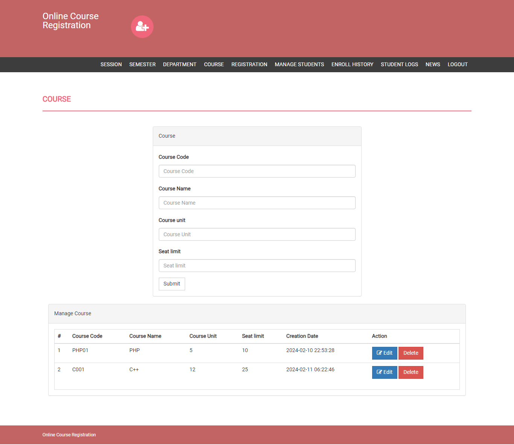

# Online Course Registration System

This project is a simple online course registration system developed using PHP.

---

## Project Modules

This project is divided into two modules:

### Admin

- Admin registers students and provides username, password, and pincode.  
- Pincode is used when a student enrolls for a course.  
- Admin can manage sessions, semesters, departments, courses, students, and student logs.  
- Admin can also add or delete the latest news and updates related to students.

### Student

- Student can log in with a valid registration number and password provided by admin.  
- Student can enroll in courses and print out the registered courses.

---

## Installation Steps

1. Download and unzip the file on your local system.  
2. Copy the `onlinecourse` folder into your web server's root directory.  
3. Database Configuration:

### Database Configuration

- Open PHPMyAdmin.  
- Create a database named `onlinecourse`.  
- Import the `onlinecourse.sql` file (available inside the zip package).  
- Open your browser and go to `http://localhost/onlinecourse`.

---

## Login Details

### Admin

- Username: `admin`  
- Password: `Test@123`

### Student

- Registration No.: `10806121`  
- Password: `Test@123`  
- Student Pincode for course enrollment: `822894`

---

## Screenshots

  
  

*(Make sure to upload the screenshots to the `onlinecourse/assets/img/` folder in your repo.)*

---

## License

MIT License
